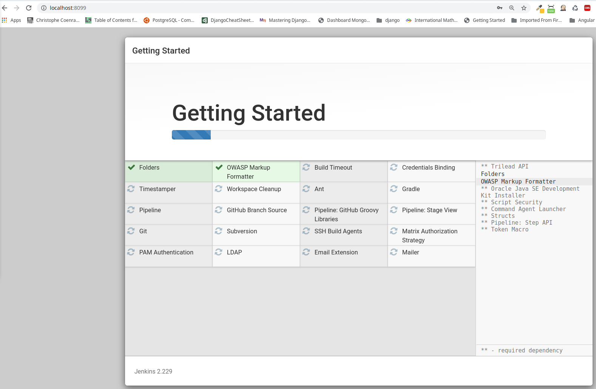

# Jenkins installation with Docker


```
$ mkdir jenkins_home
$ docker-compose up
# or,
$ docker-compose up -d
$ docker-compose ps
$ sudo docker logs -f sh_jenkins

*************************************************************
*************************************************************
*************************************************************

Jenkins initial setup is required. An admin user has been created and a password generated.
Please use the following password to proceed to installation:

7f16d6fa6e0d4d4bb04491924dd68448

This may also be found at: /var/jenkins_home/secrets/initialAdminPassword

*************************************************************
*************************************************************
*************************************************************

```

Copy the **password** to proceed and Click **Next**.

Select  "**Install suggested plugins**" and click **Next**.



```
Username: jenkins
Password: admin1234
Full name: Jenkins Admin
E-mail address: jenkins@jn.com
```

```
$ sudo docker exec -it sh_jenkins bash
jenkins@7f9fe2511545:/$ uname -a
Linux 7f9fe2511545 4.15.0-91-generic #92~16.04.1-Ubuntu SMP Fri Feb 28 14:57:22 UTC 2020 x86_64 GNU/Linux
jenkins@7f9fe2511545:/$ cat /etc/os-release 
PRETTY_NAME="Debian GNU/Linux 9 (stretch)"
NAME="Debian GNU/Linux"
VERSION_ID="9"
VERSION="9 (stretch)"
VERSION_CODENAME=stretch
ID=debian
HOME_URL="https://www.debian.org/"
SUPPORT_URL="https://www.debian.org/support"
BUG_REPORT_URL="https://bugs.debian.org/"
jenkins@7f9fe2511545:/$ exit
$
$
```